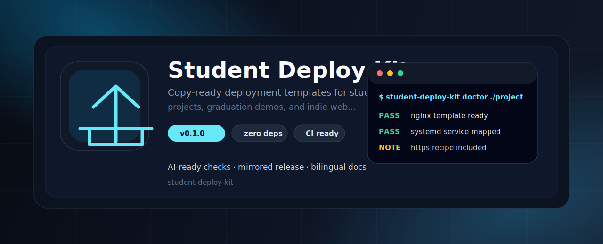
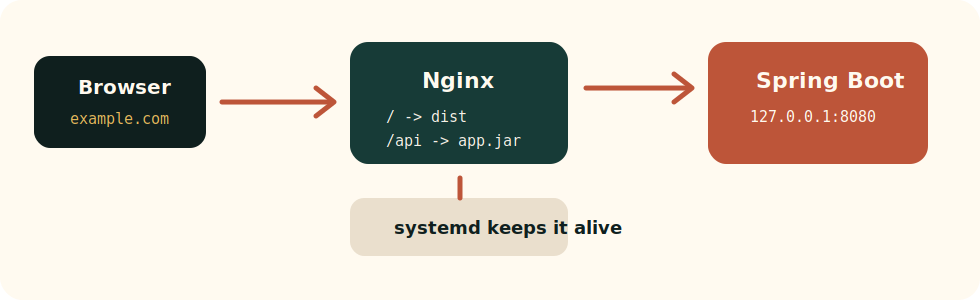

<p align="center">
  
</p>

<h1 align="center">Student Deploy Kit</h1>

<p align="center">
  <b>Copy-ready deployment templates for student projects, graduation demos, and indie web apps.</b>
</p>

<p align="center">
  <a href="README.zh-CN.md">简体中文</a>
  ·
  <a href="#quick-start">Quick Start</a>
  ·
  <a href="#recipes">Recipes</a>
  ·
  <a href="#good-first-issues">Contribute</a>
</p>

<p align="center">
  <a href="https://github.com/aolingge/student-deploy-kit/actions/workflows/validate.yml"></a>
  <a href="LICENSE"></a>
  <a href="https://github.com/aolingge/student-deploy-kit/releases"></a>
  
</p>

---

<table>
  <tr>
    <td width="25%" valign="top">
      <b><a href="nginx-configs/">Nginx & HTTPS</a></b><br />
      Reverse proxy, TLS, CORS, security headers.
    </td>
    <td width="25%" valign="top">
      <b><a href="springboot-deploy/">Spring Boot Deploy</a></b><br />
      systemd, jar release, logs, health checks.
    </td>
    <td width="25%" valign="top">
      <b><a href="frontend-deploy/">Frontend Deploy</a></b><br />
      dist upload, static sites, SPA fallback.
    </td>
    <td width="25%" valign="top">
      <b><a href="server-security/">Server Security</a></b><br />
      SSH, firewall, fail2ban, baseline hardening.
    </td>
  </tr>
</table>

<p align="center">
  
</p>

## Why This Exists

Most student projects do not fail at coding. They fail at the last mile:

- the Spring Boot jar runs locally but not on a server;
- Nginx reverse proxy, CORS, HTTPS, and SPA refresh keep breaking;
- Vue or React builds are ready, but nobody knows where `dist/` should go;
- firewall, systemd, logs, and Docker examples are scattered across random posts.

**Student Deploy Kit turns those repeated deployment problems into copy-ready templates.**

## 30-Second Map

```text
Browser
  |
  v
Nginx :80/:443
  |-- /        -> frontend dist/ or static HTML
  |-- /api/    -> Spring Boot on 127.0.0.1:8080
  |-- HTTPS    -> Certbot-managed certificate
  |-- logs     -> /var/log/nginx/*.log

systemd
  |-- keeps app.jar running
  |-- restarts after reboot
  |-- writes logs for debugging
```

## Quick Start

Deploy a common Spring Boot + Vue/React project:

```bash
# 1. Deploy the backend jar.
sudo bash springboot-deploy/deploy-springboot.sh \
  --app-name demo-api \
  --jar target/demo-api.jar \
  --deploy-dir /opt/demo-api \
  --port 8080

# 2. Deploy the frontend build output.
sudo bash frontend-deploy/deploy-static.sh \
  --source dist \
  --target /var/www/demo-web

# 3. Enable the Nginx full-stack template.
sudo cp nginx-configs/fullstack-springboot.conf /etc/nginx/sites-available/demo.conf
sudo ln -s /etc/nginx/sites-available/demo.conf /etc/nginx/sites-enabled/demo.conf
sudo nginx -t && sudo systemctl reload nginx
```

You know it worked when:

```bash
curl -I http://example.com
sudo systemctl status demo-api --no-pager
```

Nginx should return `200` or `301`, and `demo-api` should be `active (running)`.

## Recipes

| I want to... | Start here |
| --- | --- |
| Deploy a static portfolio or Vue/React site | [`nginx-configs/static-site.conf`](nginx-configs/static-site.conf), [`docs/frontend-vps.md`](docs/frontend-vps.md) |
| Put Spring Boot behind Nginx | [`nginx-configs/springboot-reverse-proxy.conf`](nginx-configs/springboot-reverse-proxy.conf), [`docs/springboot-vps.md`](docs/springboot-vps.md) |
| Deploy frontend + backend on one domain | [`nginx-configs/fullstack-springboot.conf`](nginx-configs/fullstack-springboot.conf) |
| Add HTTPS with Certbot | [`nginx-configs/https-certbot.conf`](nginx-configs/https-certbot.conf) |
| Fix CORS for an API | [`nginx-configs/cors-api.conf`](nginx-configs/cors-api.conf) |
| Run a full-stack Docker example | [`docker/docker-compose.fullstack.yml`](docker/docker-compose.fullstack.yml) |
| Harden a new Ubuntu VPS | [`server-security/checklist.md`](server-security/checklist.md), [`server-security/ubuntu-baseline.sh`](server-security/ubuntu-baseline.sh) |
| Debug a broken deployment | [`docs/troubleshooting.md`](docs/troubleshooting.md), [`docs/quick-command-map.md`](docs/quick-command-map.md) |

## What's Inside

```text
student-deploy-kit/
├─ nginx-configs/        # static site, reverse proxy, HTTPS, CORS, security headers
├─ springboot-deploy/    # deploy script, systemd service, logrotate, health check
├─ frontend-deploy/      # Vue/React/static site deploy script and Actions example
├─ server-security/      # Ubuntu firewall, fail2ban, and baseline checklist
├─ docker/               # Spring Boot, frontend, and full-stack Compose examples
├─ docs/                 # guides, FAQ, troubleshooting, command map
├─ examples/             # tiny static site for smoke testing
└─ scripts/validate.sh   # repository template validation
```

## Tiny Example

The repository includes a static smoke-test page:

```bash
sudo bash frontend-deploy/deploy-static.sh \
  --source examples/static-site \
  --target /var/www/demo-web
```

Then enable [`nginx-configs/static-site.conf`](nginx-configs/static-site.conf) and reload Nginx.

## Safety Rules

- Read every script before running it with `sudo`.
- Replace placeholders like `example.com`, `/opt/demo-api`, and `/var/www/demo-web`.
- Do not commit `.env`, private keys, SSH keys, database passwords, cookies, or tokens.
- Run `sudo nginx -t` before reloading Nginx.
- Keep Spring Boot behind Nginx unless you intentionally expose it.

## Validate Templates

```bash
bash scripts/validate.sh
docker compose -f docker/docker-compose.fullstack.yml config
```

The GitHub Actions workflow runs the same template validation on every push and pull request.

## Good First Issues

This project is designed to grow by adding small, practical templates:

- Node.js + PM2 + Nginx deployment.
- FastAPI + systemd + Nginx deployment.
- Alibaba Cloud / Tencent Cloud VPS guide.
- Caddy templates.
- Baota Panel migration notes.
- Windows Server notes.

Open issues are here: <https://github.com/aolingge/student-deploy-kit/issues>

## License

MIT


## Quality Gate

Use this project as a repeatable gate before an AI agent marks work as done:

- [Quality gate guide](docs/quality-gates.md)
- [Copy-ready GitHub Actions example](examples/github-action.yml)

